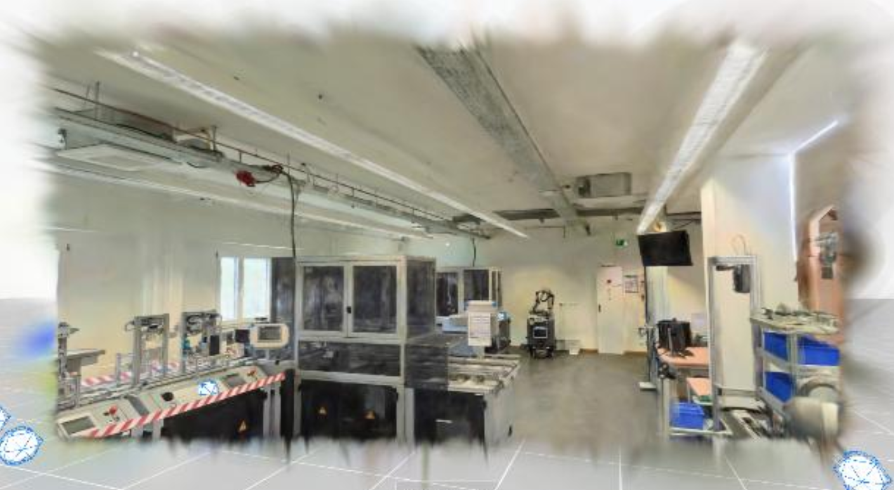
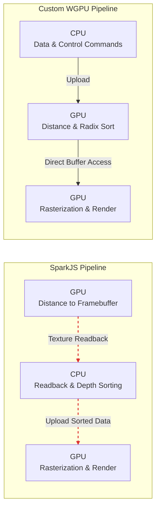
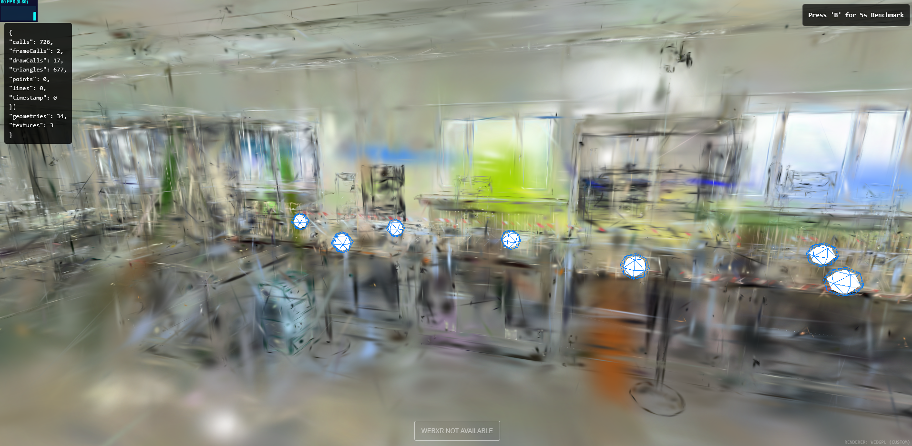
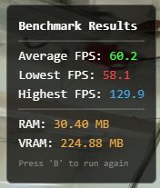

# Gaussian Splatting Renderer

This high-performance rendering pipeline is built on native WebGPU abstractions via wgpu and features a customized local copy of the wgpu-3dgs-viewer crate. It exposes a minimal WASM interface, designed for seamless integration into complex web-based environments.

---

> **This implementation serves as the rendering engine of another project.** <br>
> **This is my associated report:**

---

# Project Scope

The initial state of the project was a web-based Gaussian splatting
viewer built with Three.js for 3D graphics. The renderer was based on
SparkJS, which reads, parses, and displays pre-scanned .ply files. It
already included a camera controller and VR integration. There was also
a basic debug menu that was very helpful for finding and validating
possible optimization approaches.

The main bottleneck of the pipeline was the sorting of each splat for
every frame and the constant transfer of data between the GPU and CPU.
It is explained in the SparkJS documentation that the calculation of
distances from the camera to each splat is done on the graphics
processor. The individual sorting is performed on the CPU, before the
compressed data is then sent to the GPU again for rendering. Since WebGL
2.0, which is based on OpenGL ES 3.0, doesn't yet support compute
shaders or storage buffers, the data had to be sent back to the CPU
before rendering anyway.

This created a bottleneck, which I observed in the browser's performance
runtime analysis. Over 30% of frame time was spent on `getBufferSubData`
calls (GPU to CPU) and another 20% on `texSubImage2D` calls (CPU to
GPU). This is less significant on machines with integrated GPUs and
shared memory, since the data transfer happens directly in RAM either
way. But I suspected the possibility for optimization on more powerful
computers to be very noticeable. Therefore, my final objective for this
project was the integration of a modern rendering pipeline that would
fix these exact problems.

First, I inspected the SparkJS renderer a little more, since the
prerelease version 2.0 was freshly released and brought some major
performance updates. This gave me a feel for Gaussian splat rendering,
which was a new technology for me. I experimented with LOD trees and
display settings, which provided a good reference for the maximum
performance that could be achieved with this kind of setup.

After that, I did all necessary preparation and research for my custom
rendering approach. I settled on Rust since it is the industry standard
for native speed in the web and can be easily compiled into WebAssembly.
I also had previous experience with wgpu, which is a very safe wrapper
crate that automatically targets the native graphics API without giving
away any low-level control. It is built with the WebGPU standard in
mind, making it the perfect fit for this project.

Additionally, I used the wgpu-3dgs-viewer crate, which implements
barebones Gaussian splatting functionality and integrates into any wgpu
project with minimal dependencies (which unfortunately means a lot of
boilerplate setup). This crate was not specifically made for web
integration, and even less for VR, leading to some issues that I will
discuss later.

After a lot of testing, changes, and VR integration attempts, I settled
on a fallback architecture. In this document, I will explain every
concept, implementation, and problem that occurred during this work.

# SparkJS Pipeline and LOD Optimization

## Concept & Implementation

At the start of the optimization, the focus was the SparkJS renderer
itself. The documentation had a chapter about performance tuning, which
was very helpful. I changed the `maxStdDev` parameter from its default
value of 8 to 3, which limits the Gaussian falloff. Another noteworthy
parameter was `clipXY`, which discards splats outside of screen space in
the fragment shader. After setting it to 1.0, which represents the exact
screen bounds, the effect became visible, especially when making fast
turns. I also tried changing the transparency falloff of the individual
splats, but none of those parameters seemed to have a big impact on
performance on my machine.

Everything was tested on my home computer, which has a Ryzen 7 5800X,
32GB of RAM, an RTX 4070 Ti, and 16GB of VRAM. I would estimate that the
effect could be greater on weaker machines, for example, laptops with an
iGPU. There, the bottleneck is shifted, and actual rendering
optimizations would be a more significant improvement. But since this
was not the main focus of my optimization plan, I moved on to the next
promising test.

<figure id="fig:placeholder" data-latex-placement="H">

<figcaption>Parameter Experimentation</figcaption>
</figure>

After deactivating the `autoUpdate` function of the renderer, I
implemented a threshold check that only updates SparkJS after the camera
moves. Theoretically, this would only sort every splat when the user
crosses a rotation or movement delta. Unfortunately, this also didn't
generate a big performance increase on my machine, because of the same
reasons stated before. But it was a good test, which I would use later
in the project to optimize my custom renderer. After eliminating the
sorting and data transfer bottlenecks, this change would become the
single biggest performance increase in my Rust implementation.

``` {caption="Update Threshold"}
const deltaPos = camera.position.distanceTo(lastSortPos);
const deltaRot = camera.quaternion.angleTo(lastSortQuat);

if (deltaPos > MOVE_THRESHOLD || deltaRot > ROT_THRESHOLD_RAD) {
    spark.update({scene, camera});
    lastSortPos.copy(camera.position);
    lastSortQuat.copy(camera.quaternion);
}
```

Another experimental approach was to implement custom frustum culling
with so-called Dyno Shaders. This concept is SparkJS-specific and allows
the customization of splat processing. The idea was to cull the splats
outside of a specific NDC range as an extra step in the pipeline before
rendering. I implemented a `DynoFrustumCull` class following the SparkJS
documentation, but in the end, its behavior was extremely similar to the
`clipXY` parameter. Unfortunately, SparkJS abstracts a lot of the
pipeline, so I couldn't experiment with clipping in different stages.

The last and most promising optimization was the newly added level of
detail (LOD) features. SparkJS added a completely built-in LOD tree
system with the release of version 2.0. You simply had to set the `lod`
parameter to `true` when loading a mesh. This would lead to longer
loading times at the start of the application, but cause a notable fps
boost. Different Foveate settings in the renderer object could be
configured, so the chunking would just affect splats behind or at the
edges of the camera.

There was also a Rust tool for pre-built LOD trees, which was somewhat
hidden in the GitHub preview branch of the library. With that, you could
generate the tree beforehand, giving you a chunked `.rad` file. The
loading time would decrease almost back to the original time, and the
positive effects of the optimization still remained. This concluded the
theoretical limit of the SparkJS optimization approach. The main
bottlenecks were not completely solved, but their impact was reduced.

## Performance Evaluation

The baseline performance was evaluated in the 4 million splat laboratory
scene on my home computer (Ryzen 7 5800X, RTX 4070 Ti). With an uncapped
framerate on Firefox, I reached around 140-180 fps when moving around
and 125 fps when viewing the whole scene from a specific angle. The
unoptimized scene required rendering and sorting around 8 million
triangles per frame.

Changing the base parameters of the SparkRenderer object caused a minor
gain of around 20 fps. After adding the rendering update with the
movement threshold, the performance only changed marginally. This shows
that the continuous update calls were never the real bottleneck. SparkJS
seems to offload the heavy calculations to background threads, so the
main render loop isn't slowed down by them. The Dyno Frustum Culling
also brought no measurable performance gain. The Level of Detail
implementation, on the other hand, provided an increase of up to 60 fps,
especially from camera angles where you can see the whole scene. This is
extremely impressive when taking into consideration that I was using the
biggest splat model possible. I tried different LOD configurations,
which I compared in the following table.

| Metric | Original | Live LOD | Pre-Build LOD | LOD Paging |
|--------|---------:|---------:|--------------:|-----------:|
| FPS (moving) | 140–180 | 160–200 | 160–200 | 150–180 |
| FPS (whole scene) | 125 | 180 | 170–200 | 140 |
| Loading Time | 1 s | 8 s | 3 s | 1 s |
| Triangles | 8 M | 2.5–4.5 M | 1.5–3 M | 1.5–3 M |

**Table: SparkJS Performance Comparison**

The **Original** setup represents the unoptimized baseline, without any
LODs or other changes. While it loads the fastest, it must render all 8
million triangles, yielding the lowest framerate. Activating the basic
LOD implementation (**Live LOD**) by setting `lod: true` dynamically
builds the tree at the start of the application, which explains the long
8-second loading time. However, after the initial load, it is the most
stable out of all options, with no big framerate drops or fluctuations.

Evaluating the **Pre-Build LOD** approach shows the performance of an
optimized `.rad` file, generated beforehand using the Rust tool from the
SparkJS repository. The loading time is still higher than the original
since the browser has to prepare the LOD functionality, but bypassing
the tree generation saves a lot of time. Because the offline Rust tool
has more time to create a highly optimized version of the tree, the
number of triangles on screen is reduced by up to 1.5 million depending
on the camera position. Despite this, the framerate fluctuates more than
in the live setup.

Finally, the **LOD Paging** method divides the tree into chunks that get
dynamically loaded only when needed. The initial loading time is
extremely fast, but the performance is highly unstable and very
network-dependent. Furthermore, this approach creates over 10 different
files for the 4 million splat model that all have to live in the project
directory, which makes it much harder to manage.

Since this was just an exploratory step and not the actual main focus of
the project, I will not do a deeper performance analysis or test on
low-end devices. These results will simply be used as a baseline
comparison for the final custom renderer, which I will explain in the
following chapters.

# Custom Rust/WASM Splat Renderer

## Concept

The concept for the new rendering architecture was based on a custom
Rust implementation compiled to WebAssembly. I began the development in
an isolated Rust project before later integrating it into the main
application. To get full control over the pipeline (something I was
lacking with SparkJS), I used `wgpu`, which is a very thin wrapper based
on the WebGPU standard. Originally, it was developed for desktop
applications, featuring native compilation to Vulkan, Metal, or DirectX
depending on the system. But since it was specifically built upon the
WebGPU specification, it can also run in the browser with minimal
changes.

When the Rust code is compiled to WebAssembly, `wgpu` automatically
targets the WebGPU JavaScript API if the browser provides it. There is
even a built-in fallback option for WebGL 2.0, which I ignored since it
would defeat the purpose of the whole experiment. WebGPU natively
supports compute shaders and storage buffers, solving the two biggest
bottlenecks of the SparkJS renderer. The sorting of each splat relative
to the camera could now be executed in parallel on the graphics
processor. This eliminated the first major overhead: the CPU-based
sorting. The second, and arguably even more important change, was the
direct access to GPU buffers. This capability allows the renderer to
store splat data directly on the graphics card. As a result, all
geometry data only had to be uploaded once, even for preprocessing and
sorting. In the following diagram, the differences between the SparkJS
and custom 3DGS architectures are highlighted:



I utilized the `wgpu-3dgs-viewer` crate, which provides several core
functionalities. First, a preprocessor calculates which splats are
visible each frame and culls them before they are projected into camera
space. Next, the radix sorter, built with compute shaders, orders the
splats based on their depth from the camera. Because this data is stored
in GPU buffers that can be accessed during rendering, there is no
involvement from the CPU other than sending commands. Finally, the
renderer draws the splats from back to front using a Gaussian
distribution.

Since the crate is extremely modular and designed with minimal
dependencies, every step can be modified to a certain degree.
Consequently, the complete `wgpu` setup had to be written manually. This
included device and queue management, synchronization, depth buffer
integration, command encoding, and ultimately camera and viewport
updates.

Because Three.js was still necessary for camera movement, VR
controllers, and points of interest, the final `wgpu` frame surface had
to be shared. Copying every single frame to the final WebGL canvas would
be extremely inefficient. WebGPU and WebGL live in entirely different
contexts and do not share memory. Transferring this data would require a
detour through the CPU, bringing back the exact bottleneck I was trying
to solve. My solution was to stack two different HTML canvases on top of
each other, enabling alpha transparency and using different z-indices.
The bottom canvas was controlled by the WebGPU renderer and contained
the final splat model. Meanwhile, the top canvas was used by Three.js to
display points of interest and capture user input. Necessary
information, such as camera position, was simply passed down to the
splat renderer via WebAssembly function calls.

This canvas stacking approach effectively bypassed the API conflict, but
I also experimented with another architectural shift. Three.js itself
can use a WebGPU backend instead of its default WebGL render API.
Switching to this backend resulted in a surprisingly smoother
experience, particularly during a VR simulation test. In this
experiment, I created a debug view mimicking VR by splitting the screen
in half with two cameras for each eye. For this setup, I had to pass the
frame data from my renderer as a texture, and the performance increase
with the WebGPU Three.js backend was massive. This suggests that the
browser's compositor automatically shares memory internally across
different WebGPU contexts, significantly reducing overhead. However,
this specific change introduced severe problems for actual WebXR
rendering, which I will discuss in the dedicated chapter \"WebXR
Integration Attempt\".

## Implementation Details

As mentioned earlier, the `wgpu-3dgs-viewer` crate does not cover any
concepts outside of the core splat features. Therefore, I had to
manually configure the `wgpu` setup and rendering pipeline. Since
Gaussian Splatting is extremely demanding on the hardware, the power
preference is explicitly set to `HighPerformance`. This ensures that the
browser selects a dedicated graphics card rather than defaulting to a
weaker integrated GPU to save battery.

In a native desktop application, this code would query the operating
system directly. However, when compiling for WebAssembly, `wgpu` safely
translates this request to the browser's hardware abstraction layer.
Finally, the `AutoNoVsync` present mode uncaps the framerate. While this
is not optimal for a final production build, it was absolutely necessary
during development for an accurate performance assessment.

``` {#lst:wgpu_init caption="WGPU adapter request \\& surface configuration" label="lst:wgpu_init"}
let adapter = instance
    .request_adapter(&wgpu::RequestAdapterOptions {
        power_preference: wgpu::PowerPreference::HighPerformance,
        compatible_surface: Some(&surface),
        force_fallback_adapter: false,
    })
    .await
    .map_err(|e| format!("Error Wgpu Adapter: {:?}", e))?;

let config = wgpu::SurfaceConfiguration {
    usage: wgpu::TextureUsages::RENDER_ATTACHMENT | wgpu::TextureUsages::COPY_DST,
    format: surface_format,
    width,
    height,
    present_mode: wgpu::PresentMode::AutoNoVsync,
    alpha_mode,
    view_formats: vec![surface_format.remove_srgb_suffix()],
    desired_maximum_frame_latency: 2,
};

surface.configure(&device, &config);
```

The `wgpu-3dgs-viewer` crate is still in active development by a single
person. It hardcodes the background clear color to solid black and does
not natively allow alpha transparency. To get around this limitation, I
could not use the standard remote dependency from `crates.io`. Instead,
I cloned the repository locally into my project workspace to modify the
source code.

In the following code snippet, you can see the exact change. I created a
command encoder and injected a custom render pass to clear the screen
with specific color and alpha values. Having this local copy also proved
to be very useful during the VR integration and debugging phase later
on.

``` {#lst:clear_pass caption="Custom Clear Pass" label="lst:clear_pass"}
let mut encoder = self
    .device
    .create_command_encoder(&wgpu::CommandEncoderDescriptor {
        label: Some("Render Encoder"),
    });

{
    let _clear_pass = encoder.begin_render_pass(&wgpu::RenderPassDescriptor {
        label: Some("Clear Pass"),
        color_attachments: &[Some(wgpu::RenderPassColorAttachment {
            view: &view,
            resolve_target: None,
            ops: wgpu::Operations {
                load: wgpu::LoadOp::Clear(wgpu::Color {
                    r: 1.0, g: 0.5, b: 0.5, a: 1.0,
                }),
                store: wgpu::StoreOp::Store,
            },
            depth_slice: None,
        })],
        depth_stencil_attachment: None,
        timestamp_writes: None,
        occlusion_query_set: None,
        multiview_mask: None,
    });
}

viewer.render(&mut encoder, &view, None);
self.queue.submit(std::iter::once(encoder.finish()));
```

The `.ply` splat file is fetched in TypeScript and passed into the
WebAssembly module as a raw array of bytes. The `Cursor` acts as a
memory wrapper, allowing this raw data to be read exactly like a
traditional file stream. The `Gaussians::read_from` function then parses
the binary attributes into structured objects. Next, a new `Viewer`
instance is created, internally allocating the necessary storage buffers
in VRAM and preparing the compute shaders.

Lastly, a `needs_update` flag is set, tying directly back to the earlier
concept of threshold-based updates. Since I have complete control over
this custom renderer, I can schedule the sorting and rendering updates
freely. Therefore, the entire pipeline simply stands still as long as
the user does not move the camera and no new model is loaded.

``` {#lst:dgs_init caption="Parsing PLY Binary Data \\& Initializing Core 3DGS Viewer" label="lst:dgs_init"}
pub fn load_model(&mut self, ply_data: &[u8]) -> Result<(), String> {
    let mut cursor = Cursor::new(ply_data);

    let gaussians = gs::core::Gaussians::read_from(&mut cursor, gs::core::GaussiansSource::Ply)
        .map_err(|e| format!("Error PLY Parsing: {:?}", e))?;

    let camera = gs::Camera::new(0.1..1e4, 60f32.to_radians());

    let mut viewer = gs::Viewer::new(&self.device, self.config.view_formats[0], &gaussians)
        .map_err(|e| format!("Error View Creation: {:?}", e))?;

    ...

    self.viewer = Some(viewer);
    self.camera = Some(camera);
    self.needs_update = true;

    Ok(())
}
```

# WebXR Integration Attempt

## Concept

Rendering for Virtual Reality requires generating two viewpoints per
frame, which fundamentally changes how the Gaussian Splatting pipeline
must be optimized. Executing the complete 3DGS pipeline twice per frame
would double the GPU workload. Therefore, the heavy sorting process had
to be decoupled from rendering. Since I already had a local copy of the
3DGS viewer library, this proved to be fairly easy. I modified the
codebase so a public interface for both functions could be accessed
separately. This allowed for the optimization of calculating the depth
sorting only once. I used the left eye as a reference point, which was
much easier than interpolating a middle matrix between the left and
right eyes.

The final rasterization step, on the other hand, had to be executed
individually for each eye. Because WebXR operates strictly in WebGL, the
resulting frame had to be passed to Three.js. To optimize this transfer,
both eyes were rendered into a single texture in a side by side format.
Inside Three.js, two screen quads were attached to the render layer of
each eye. I then used custom fragment shaders to map the correct half of
the texture to the corresponding view.

I also implemented a desktop debugging mode that splits the screen in
half in order to simulate VR rendering. This was crucial because I did
not always have access to a VR headset. Additionally, I utilized the
immersive web emulator to test the basic functionality.

The major performance issue was that the stereo texture had to be moved
from WebGPU memory to Three.js since I could not use the canvas stacking
trick in VR. Unfortunately, the Three.js WebGPU backend is not yet
recommended for production for WebXR. Therefore, I was not able to
eliminate the main bottleneck of a GPU to CPU readback every single
frame. But I added a render scale that could downscale the size of the
texture that had to be sent between CPU and GPU. This influences quality
but yields a lot better performance on machines with lower memory
bandwidth.

This is just a brief summary of the conversion process from mono to
stereo rendering. The occurring problems are actually much more
interesting because they involve a very unexplored and non standardized
combination of technologies.

## Implementation Details

The following code snippet shows how the previously monolithic pipeline
is now split into independent sort and draw function calls. The left eye
is being used as a reference for depth sorting. This is way easier than
interpolating a middle matrix but yields the same results. Because the
distance between the eyes is very small, this is a fine precision to
performance tradeoff. The matrices inside the RawCamera struct are being
passed directly from Three.js to WebAssembly as a float array.

``` {#lst:stereo_sort_draw caption="One Sort For Both Eyes" label="lst:stereo_sort_draw"}
let sort_camera = gs::RawCamera {
    view_matrix: self.left_view,
    proj_matrix: self.left_proj,
};

viewer.update_camera(&self.queue, &sort_camera, tex_size);
viewer.sort(&mut encoder);

let left_camera = gs::RawCamera {
    view_matrix: self.left_view,
    proj_matrix: self.left_proj,
};
viewer.update_camera(&self.queue, &left_camera, tex_size);
viewer.draw(&mut encoder, &offscreen_view, None);

let right_camera = gs::RawCamera {
    view_matrix: self.right_view,
    proj_matrix: self.right_proj,
};
viewer.update_camera(&self.queue, &right_camera, tex_size);
viewer.draw(&mut encoder, &offscreen_view, None);
```

WebGL uses a depth range from negative one to positive one for its
normalized device coordinates. WebGPU, on the other hand, expects a
depth range from zero to one. If you pass the raw projection matrix
without this conversion, the geometry will be distorted.

``` {#lst:webgl_webgpu_matrix caption="WebGL To WebGPU Coordinate Conversion" label="lst:webgl_webgpu_matrix"}
const webglToWebgpu = new THREE.Matrix4().set(
    1, 0, 0,   0,
    0, 1, 0,   0,
    0, 0, 0.5, 0.5,
    0, 0, 0,   1
);

const projLeftWGPU = new THREE.Matrix4().multiplyMatrices(
    webglToWebgpu,
    camLeft.projectionMatrix
);
const projRightWGPU = new THREE.Matrix4().multiplyMatrices(
    webglToWebgpu,
    camRight.projectionMatrix
);
```

Instead of sending two images to the CPU and combining them, the side by
side texture is already combined on the GPU. This command runs entirely
on the graphics card memory, which is extremely efficient. This specific
snippet shows how the right eye render is placed into the final frame.

``` {#lst:texture_copy caption="Side-By-Side Render Texture" label="lst:texture_copy"}
encoder.copy_texture_to_texture(
    wgpu::TexelCopyTextureInfo {
        texture: offscreen_tex,
        mip_level: 0,
        origin: wgpu::Origin3d::ZERO,
        aspect: wgpu::TextureAspect::All },
    wgpu::TexelCopyTextureInfo {
        texture: &frame.texture,
        mip_level: 0,
        origin: wgpu::Origin3d {
            x: half_width,
            y: 0,
            z: 0 },
        aspect: wgpu::TextureAspect::All },
    wgpu::Extent3d {
        width: half_width,
        height,
        depth_or_array_layers: 1 },
);
```

The combined stereo texture is passed from WebGPU to Three.js. It gets
sent to two quads covering each eye on a different render layer. Both
fragment shaders get the same uniform and sample their respective eye
specific UVs. Each shader gets applied to the correct quad as a Three.js
material.

``` {#lst:vr_fragment_shaders caption="Fragment Shader Eye Texture Mapping" label="lst:vr_fragment_shaders"}
const fragShaderLeft = `
    uniform sampler2D tDiffuse;
    varying vec2 vUv;
    void main() {
        vec2 texUv = vec2(vUv.x * 0.5, vUv.y);
        gl_FragColor = texture2D(tDiffuse, texUv);
    }
`;

const fragShaderRight = `
    uniform sampler2D tDiffuse;
    varying vec2 vUv;
    void main() {
        vec2 texUv = vec2(vUv.x * 0.5 + 0.5, vUv.y);
        gl_FragColor = texture2D(tDiffuse, texUv);
    }
`;
```

## Failure Analysis

Transitioning from desktop rendering to standalone VR hardware proved to
be a problem. The final goal was to get the software to run on the Meta
Quest 3. But even though the eyes were correctly mapped after some
testing, many other bugs and hurdles would appear over the next few
weeks. The most obvious one was that the splat model was not rendering
correctly. You could see the rough shape, but colors were incorrect and
splats were missing or rotated weirdly. The solution for those visual
artifacts was not clear, and in this section I will detail everything I
found out. VR headsets often use asymmetric projection matrices because
the eyes are not perfectly centered. A suspicion was that the 3DGS
viewer crate does not account for that and therefore distorts the model.
But after searching through the local copy of the library, I verified
that everything is handled correctly.

After that, I gathered as much information as possible through data logs
and compared PC to VR specifications. There I found some notable
differences. The attribute `max_storage_buffer_binding_size` inside the
VR adapter limits is 128 MB. This boundary can quickly be reached if the
model has millions of splats. But the corruption also occurred when
loading smaller models. The real limit seemed to be the
`max_compute_workgroup_storage_size`, which is 32 kB on the Meta Quest
3. This is half of what seems to be the standard for desktop GPUs and
even iGPUs.

``` {#lst:limit_override caption="Override Compute Limits To Simulate VR Constraints" label="lst:limit_override"}
let mut limits = adapter.limits();

limits.max_compute_workgroup_storage_size = 32768;

let (device, queue) = adapter
    .request_device(&wgpu::DeviceDescriptor {
        label: Some("3DGS Device"),
        required_features: wgpu::Features::empty(),
        required_limits: limits,
        experimental_features: ExperimentalFeatures::disabled(),
        memory_hints: wgpu::MemoryHints::Performance,
        trace: wgpu::Trace::Off,
    })
    .await
    .map_err(|e| format!("Error Device Creation {}", e))?;
```

I tested this by manually overriding the limit of the application to 32
kB on my computer. This resulted in a black screen. After taking a look
at the `radix_sorter.rs` file in the local copy of the 3DGS crate, I
found out that the workgroup size is hardcoded with a comment that reads
\"DO NOT CHANGE, shader assume this\". In conclusion, the compute shader
seems to be optimized for this specific value and fails silently on the
VR headset. Therefore, I stopped working on the VR integration and
focused on the complete optimization for computers with a stable GPU
architecture. Since the VR code for my custom renderer is really
interesting, I kept it in my Rust codebase but marked it as deprecated.

<figure id="fig:placeholder2" data-latex-placement="H">

<figcaption>Corrupted Rendering</figcaption>
</figure>

# Renderer Fallback Strategy

## Concept

Because experimental APIs like WebGPU are not supported on all
platforms, the architecture relies on an interface driven fallback
strategy. The core is the `ISplatRenderer` interface, which abstracts
the entire rendering lifecycle. This includes initialization, loading,
updating, and memory profiling. This allows the main scene to operate
completely agnostic of the underlying graphics API. The
`start_root_scene` function takes the user agent and WebGPU support of
the browser into account. It uses the custom Rust renderer with a
Three.js WebGPU backend by default. If the browser does not support this
or VR hardware is detected, the system falls back on the stable SparkJS
renderer with a WebGL backend for Three.js. Each renderer has completely
different internal logic but can be seamlessly integrated using the
exposed functions of the interface.

## Implementation Details

The following interface defines the necessary behavior for any rendering
backend. It decouples the application from the specific implementation.
Therefore, the renderer and graphics API can be swapped out during
loading based on the according conditions. It also includes a
`getRendererMemoryMB` function, which is essential for profiling.

``` {#lst:isplatrenderer caption="Renderer Interface" label="lst:isplatrenderer"}
export interface ISplatRenderer {
    init(parentElement: HTMLElement, renderer: any, scene: THREE.Scene): Promise<void>;
    loadModel(splatUrl: string, scaleFactor: number): Promise<void>;
    update(deltaTime: number, scene: THREE.Scene, camera: THREE.Camera): void;
    resize(width: number, height: number): void;
    getRendererMemoryMB(): string;
}
```

The `supportsWebGPU` variable is set based on two conditions. If VR is
detected through the user agent, the SparkJS fallback is automatically
selected. Another condition triggering the fallback is the lack of
WebGPU support in the browser. For debugging purposes, this variable can
be easily overridden or the developer can deactivate WebGPU support in
the browser settings since it is often marked as an experimental
feature. The startup sequence is wrapped in a try catch block to handle
runtime errors regarding WebAssembly or device requests. If any problem
occurs, the system falls back to the stable SparkJS version. Since
WebGPU is still under development, there is a high chance for driver
issues or other limitations. Because the fallback logic is isolated in
the setup and encapsulated through the interface, the rest of the
application is not affected by which renderer is active.

``` {#lst:fallback_logic caption="Fallback Implementation" label="lst:fallback_logic"}
const supportsWebGPU = !isClientMetaQuest && navigator.gpu !== undefined

if (supportsWebGPU) {
    try {
        threeRenderer = new WebGPURenderer({ antialias: false, alpha: true });
        splatRenderer = new WgpuWrapper();
        await splatRenderer.init(parent_element, threeRenderer, scene);
    } catch {
        if (threeRenderer) threeRenderer.dispose();
        threeRenderer = new THREE.WebGLRenderer({ antialias: false, alpha: true });
        splatRenderer = new SparkWrapper();
        await splatRenderer.init(parent_element, threeRenderer, scene);
    }
} else {
    threeRenderer = new THREE.WebGLRenderer({ antialias: false, alpha: true });
    splatRenderer = new SparkWrapper();
    await splatRenderer.init(parent_element, threeRenderer, scene);
}
```

## Performance Evaluation



To assess the performance with more accuracy, I added a simple benchmark
utility. It runs for 5 seconds when the user presses the B key and
calculates minimum, maximum, and average frames based on frame times.
The system also captures the JavaScript heap size, which only works on
Chromium based browsers, and the approximated VRAM consumption. On the
SparkJS renderer, this is calculated by the sizes of the compressed
splat mesh object data. For my custom renderer, on the other hand, this
is just the raw splat data size. Together with the already active debug
menu, I can gather a lot of information and assess the performance on
different setups.

The following statistics were collected on my home computer equipped
with a Ryzen 7 5800X, 32 GB RAM, and an RTX 4070 Ti with 16 GB VRAM and
an old laptop featuring an Intel Core i3 1005G1, 8 GB RAM, and Intel UHD
Graphics with 4 GB VRAM. For a comparable benchmark, I used the 1
million splat lab scan on my computer and the 250k splat car scan on my
laptop. I tested the custom WebGPU render pipeline with a standard
SparkJS fallback. I did not activate level of detail settings for the
tests.

### Performance – PC, Firefox, Uncapped FPS, Static Lab Scene

| Renderer | Average FPS | Lowest FPS | Highest FPS | RAM | VRAM |
|----------|------------:|-----------:|------------:|----:|------:|
| WGPU (Custom) | 700 | 80 | Max | N/A | 225 MB |
| WebGL (Spark) | 320 | 125 | Max | N/A | 55 MB |

### Performance – PC, Firefox, Uncapped FPS, Moving Lab Scene

| Renderer | Average FPS | Lowest FPS | Highest FPS | RAM | VRAM |
|----------|------------:|-----------:|------------:|----:|------:|
| WGPU (Custom) | 150 | 70 | 200 | N/A | 225 MB |
| WebGL (Spark) | 400 | 90 | Max | N/A | 55 MB |

The tables show that the wgpu renderer required up to four times more
VRAM compared to the SparkJS fallback. This is because the custom
renderer processes raw uncompressed splat data, while SparkJS has a
compressed format. This is speculation, since I don't know the exact
details of the 3DGS crate. The SparkJS renderer actually has lower FPS
when the camera is static compared to when it is moving. This happens
because the static view intentionally keeps almost every splat on screen
where nothing gets clipped by the camera view. For SparkJS more visible
splats directly increase the CPU sorting workload and memory
bottlenecks. For the custom WebGPU renderer on the other hand actual
movement is the main problem due to its lazy update and dynamic
clustering approach. On the 4 million splat scene for example the custom
renderer achieves around three times the FPS when standing completely
still. It is surprising that the performance during movement does not
scale better given that the primary theoretical bottlenecks were
resolved. Unfortunately optimizing one part of a graphics pipeline often
just creates a new bottleneck somewhere else which clearly happened
here. In my isolated Rust project the renderer runs much faster with
just a minimal HTML setup and no heavy Three.js web application wrapping
it. Investigating this specific integration overhead would be an
important task for future development.

### Performance – PC, Chrome, Capped FPS, Static Lab Scene

| Renderer | Average FPS | Lowest FPS | Highest FPS | RAM | VRAM |
|----------|------------:|-----------:|------------:|----:|------:|
| WGPU (Custom) | 60 | 50 | 80 | 30 MB | 225 MB |
| WebGL (Spark) | 60 | 58 | 70 | 80 MB | 55 MB |

### Performance – PC, Chrome, Capped FPS, Moving Lab Scene

| Renderer | Average FPS | Lowest FPS | Highest FPS | RAM | VRAM |
|----------|------------:|-----------:|------------:|----:|------:|
| WGPU (Custom) | 60 | 58 | 205 | 255 MB | 225 MB |
| WebGL (Spark) | 60 | 50 | 80 | 100 MB | 55 MB |

### Render Data – PC, Moving Lab Scene

| Renderer | Triangles | Draw Calls |
|----------|----------:|-----------:|
| WGPU (Custom) | 5–1,541 | 3–35 |
| WebGL (Spark) | 2 million | 5–37 |
| WebGL (Spark LOD) | 500k–1 million | 6–38 |

The laptop benchmarks illustrate the hardware bottleneck very well.
Static rendering performs surprisingly well, while camera movement tanks
the entire performance. The integrated graphics chip cannot handle the
GPU based sorting and constant data transfer across the shared memory
bus. The SparkJS sorting algorithm seems to be highly optimized with
WebAssembly and memory cache in mind. This is undoubtedly a better
approach for devices without a dedicated GPU architecture since compute
shaders rely heavily on raw processing power and massive memory
bandwidth. If a device lacks sufficient VRAM the regular system RAM is
used instead, which creates an even bigger bottleneck for my custom
renderer. Furthermore SparkJS features optimized data compression and
level of detail solutions which my comparatively minimal implementation
cannot keep up with yet. This project can definitely be improved upon
massively in the future but it still served as an extremely interesting
and valuable experience.

### Performance – Laptop, Chrome, Capped FPS, Static Car Scene

| Renderer | Average FPS | Lowest FPS | Highest FPS | RAM | VRAM |
|----------|------------:|-----------:|------------:|----:|------:|
| WGPU (Custom) | 60 | 15 | 285 | 60 MB | 30 MB |
| WebGL (Spark) | 35 | 27 | 45 | 43 MB | 7 MB |

### Performance – Laptop, Chrome, Capped FPS, Moving Car Scene

| Renderer | Average FPS | Lowest FPS | Highest FPS | RAM | VRAM |
|----------|------------:|-----------:|------------:|----:|------:|
| WGPU (Custom) | 11 | 7 | 37 | 26 MB | 30 MB |
| WebGL (Spark) | 45 | 13 | 55 | 43 MB | 7 MB |

# Conclusion

Developing this custom Gaussian splatting renderer was a really
interesting and educational experience. The final application relies
heavily on the stable WebGL fallback and only brings performance
increases in some specific cases. Nevertheless, it gave valuable
insights into low level graphics architecture and working with hardware
limitations. The original plan to build a highly performant custom
renderer that solves all listed bottlenecks and performance issues was
overly optimistic in hindsight. WebGPU, VR, and Gaussian splatting are
all fairly new technologies which get even more complicated when
combined. I still believe the project was a major win, especially as a
learning experience.

# Declaration of AI Usage

During the development of this project, I used AI tools for research and
sometimes to write basic boilerplate code. However, any AI was strictly
used as a supportive assistant. No code was simply copied or
automatically written except for inline HTML.

Regarding the writing process, I wrote all the text and content myself.
The AI was only used afterwards to check my grammar, spelling, and to
get the correct syntax for LaTeX.

